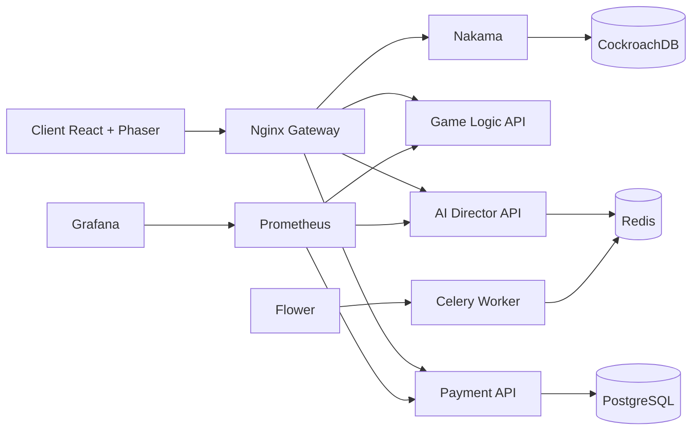

<div align="center">

# 🖤 Umbra Platform
### *Dark Fantasy Roguelite Platform · AI Narrative · Real-time Combat · Live Ops-ready*

<p>
  
  
  
  
</p>

**Une base complète pour un jeu dark fantasy cross-platform, pilotée par IA et pensée pour itérer vite.**

</div>

---

## ⚡ TL;DR

- 🎮 **Gameplay core** : combat, progression, gacha, anomalies, boss.
- 🧠 **AI Director** : génération narrative et contenu avec orchestration asynchrone (Celery + Redis).
- 💳 **Monétisation** : Stripe checkout, validation de reçus, battle pass.
- 🌐 **Stack complète locale** : client + gateway + microservices + DB + observabilité.

---

## 🧭 Table des sections

- [✨ Vue d'ensemble](#-vue-densemble)
- [🧪 Audit express (état actuel)](#-audit-express-état-actuel)
- [🏗️ Architecture](#️-architecture)
- [🚀 Démarrage rapide](#-démarrage-rapide)
- [🛠️ Commandes de développement](#️-commandes-de-développement)
- [🔐 Sécurité & secrets](#-sécurité--secrets)
- [📁 Structure du projet](#-structure-du-projet)
- [🗺️ Roadmap suggérée](#️-roadmap-suggérée)

---

## ✨ Vue d'ensemble

Umbra Platform rassemble les briques critiques d'un jeu live-service moderne :

- **Nakama** pour l'auth, le temps réel et les leaderboards.
- **3 services FastAPI** (`ai-director`, `game-logic`, `payment`) pour la logique métier.
- **Client React + Phaser** pour l'expérience de jeu web.
- **Nginx + Prometheus + Grafana** pour l'exposition et l'observabilité.

> 💡 Objectif : fournir une fondation *production-minded* tout en restant confortable en local.

---

## 🧪 Audit express (état actuel)

### ✅ Points solides

- Architecture microservices claire et cohérente.
- Docker Compose couvre app, data, queue et monitoring.
- Séparation correcte des responsabilités (`game-logic`, `ai-director`, `payment`).
- Présence de suites de tests par service + tests d'intégration.

### ⚠️ Points à surveiller

- Une partie de la documentation secondaire (`docs/README.md`) semble historique et contient des références désormais divergentes (ex: mention de Flask).
- Le README racine précédent était minimaliste par rapport à la richesse réelle du repo.

### 🎯 Action réalisée ici

Ce README a été entièrement modernisé pour:

- mieux refléter l'architecture réelle,
- accélérer l'onboarding,
- offrir une présentation plus visuelle et plus "publique".

---

## 🏗️ Architecture

### Services & ports

| Service | Port(s) | Rôle |
|---|---:|---|
| **Nakama** | `7350`, `7351` | Auth, storage, realtime, leaderboards |
| **AI Director** | `8001` | Génération narrative et contenu (LLM) |
| **Celery Worker** | - | Exécution asynchrone des tâches AI |
| **Flower** | `5555` | Monitoring des tâches Celery |
| **Game Logic** | `8002` | Combat, gacha, progression, anomalies |
| **Payment** | `8003` | Stripe checkout, webhooks, battle pass |
| **Client** | `3000` | Front React + moteur Phaser |
| **Nginx** | `8080` | API gateway |
| **PostgreSQL** | `5432` | Données paiements |
| **CockroachDB** | `26257` | Données Nakama |
| **Redis** | `6379` | Cache + broker Celery |
| **Prometheus** | `9090` | Metrics |
| **Grafana** | `3001` | Dashboards |

### Diagramme logique



---

## 🚀 Démarrage rapide

```bash
# 1) Configuration locale
cp .env.example .env
# puis éditer .env (clés IA, Stripe, etc.)

# 2) Démarrage de toute la stack
make dev

# 3) Vérification santé
make health
```

### Endpoints utiles

- 🎮 Client: `http://localhost:3000`
- 🌐 Gateway: `http://localhost:8080`
- 📈 Prometheus: `http://localhost:9090`
- 📊 Grafana: `http://localhost:3001`
- 🌸 Flower: `http://localhost:5555`

---

## 🛠️ Commandes de développement

```bash
make dev           # Start all services in development mode
make stop          # Stop all services
make clean         # Stop + remove volumes
make test          # Run all Python service tests
make test-nakama   # Type-check Nakama runtime
make test-client   # Build client
make lint          # Ruff on Python services
make format        # Black on Python services
make logs          # Tail logs
make health        # Curl health endpoints
```

<details>
<summary><strong>🔍 Conseils d'audit local (interactive checklist)</strong></summary>

- [ ] `make health` passe sur tous les services.
- [ ] `make test` est vert sur les 3 services Python.
- [ ] `make test-client` build proprement.
- [ ] Vérifier que `docker compose ps` montre les conteneurs en `healthy`.
- [ ] Ouvrir Grafana/Prometheus et valider la collecte de métriques.

</details>

---

## 🔐 Sécurité & secrets

Le projet utilise **detect-secrets** pour limiter les commits accidentels de credentials.

```bash
pip install pre-commit detect-secrets
pre-commit install
detect-secrets scan > .secrets.baseline
```

---

## 📁 Structure du projet

```text
umbra-platform/
├── client/                # Frontend React + Phaser
├── data/                  # Assets/config partagés (gacha pools, translations)
├── docs/                  # Architecture, API, game design, guides
├── infrastructure/        # Nginx, monitoring, scripts infra
├── nakama/                # Nakama server + runtime TypeScript
├── services/
│   ├── ai-director/       # Génération IA + workers Celery
│   ├── game-logic/        # Combat/progression/gacha
│   └── payment/           # Paiements Stripe + battle pass
├── tests/                 # Tests cross-service (intégration, charge)
├── docker-compose.yml
└── Makefile
```

---

## 🗺️ Roadmap suggérée

- [ ] Ajouter badges CI/CD dynamiques (tests, lint, build, coverage).
- [ ] Publier des captures UI/GIF gameplay dans le README.
- [ ] Harmoniser `docs/README.md` avec la stack actuelle (FastAPI vs legacy docs).
- [ ] Ajouter un "Architecture Decision Record" (ADR) pour les choix structurants.
- [ ] Exposer une section "Contributing quick path" (10 minutes to first PR).

---

<div align="center">

### 🌒 Umbra Platform
*Build fast. Ship dark. Scale live ops.*

</div>
