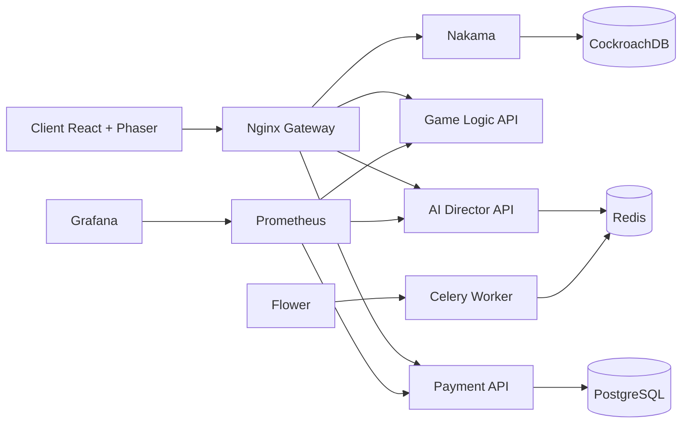

<div align="center">

# UMBRA

### Dark Fantasy · Pop Cute Manga · Roguelite · AI-Powered · LGBTQ+

<p>
  
  
  
  
</p>

**Hack’n’slash roguelite avec narration IA, romance otome LGBTQ+ et esthétique dark fantasy pop cute manga.**

*Combats. Survie. Tombe amoureux·se. L’IA écrit ton histoire.*

</div>

---

## Le Jeu

Umbra est un **hack’n’slash roguelite** où chaque run est générée par une **IA narrative** (LLM). Le Void corrompt le monde — tu explores des donjons procéduraux, tu forge des runes maudites, tu invoques des entités oubliées, et tu construis des liens profonds avec **5 compagnons romançables**. Chaque personnage utilise des **pronoms inclusifs** (il/lui, elle/la, iel/ellui) et chaque relation évolue en fonction de tes choix. L’IA adapte la narration, les dialogues et les scènes romantiques en temps réel. Aucune run ne se ressemble.

---

### Systèmes de Jeu

<table>
<tr>
<td width="50%" valign="top">

**🔮 Corruption Runes — [#68](../../issues/68)**
7 sets · 6 slots · Tainted → Abyssal · +15 · Corruption Seals

**🌀 Void Summoning — [#71](../../issues/71)**
4-step ritual · Convergence pity (soft 70, hard 90) · AI Arrival Scene

**🌙 Shadow Vigil — [#78](../../issues/78)**
3 companions patrol offline (12h cap) · AI narrative report

</td>
<td width="50%" valign="top">

**⚔️ Void Arena — [#80](../../issues/80)**
Async PvP · AI opponent teams · 5 ranks (Shadow Initiate → Void Sovereign) · weekly seasons

**🔨 Void Forge — [#105](../../issues/105)**
3 pillars: Rune Reforging, Equipment Awakening, Corruption Infusion · unlocked via Kaelan affinity

**💜 Resonance Bond — [#104](../../issues/104)**
15 levels · Echo Fragments · True Name · Void Form

</td>
</tr>
</table>

---

### Void Hierarchy — 5 Tiers d’Ennemis [#76](../../issues/76)

| Tier | Nom | Niveaux |
|:----:|-----|:-------:|
| I | **Shades** | 1–3 |
| II | **Wraiths** | 4–6 |
| III | **Sentinels** | 7–9 |
| IV | **Arbiters** | 10–12 |
| V | **Echoes** | 13+ |

> 11 types d’ennemis : Hollow Shade, Whispering Wraith, Umbral Stalker, Void Sentinel, Crimson Arbiter, Gilded Revenant, Abyssal Behemoth, Thorn Weaver, Eclipse Herald, Rift Colossus, The Nameless.

---

### Compagnons Romançables [#98](../../issues/98) [#99](../../issues/99) [#100](../../issues/100)

| Personnage | Rôle | Orientation | Pronoms | Couleur |
|:----------:|--------|:-----------:|:-------:|:-------:|
| **Kaelan** | Forgeron Maudit | Hétérosexuel | il/lui | `#ff6b35` 🟠 |
| **Lyra** | Archiviste Spectrale | Bisexuelle | elle/la | `#b39ddb` 🟣 |
| **Nyx** | Marchand du Vide | Pansexuel·le | iel/ellui | `#ffe135` 🟡 |
| **Seraphina** | Paladine Déchue | Lesbienne | elle/la | `#ff2d78` 🔴 |
| **Ronan** | Barde Itinérant | Gay | il/lui | `#00bcd4` 🟢 |

> **Affinity** 0–100 · **Resonance** 1–15 · **Relationship Preference** (joueur·se choisit)

---

### Direction Artistique [#102](../../issues/102)

| Aspect | Détails |
|--------|---------|
| **Palette** | Gothic Candy — `#ff2d78` `#b39ddb` `#ffe135` `#00bcd4` sur fonds sombres |
| **Typographie** | Cinzel Decorative (titres) · Inter (corps) · JetBrains Mono (code/stats) |
| **UI** | Manga panels · `clip-path` · particules · curseur custom |
| **Principes** | Menacing silhouette / welcoming detail · sincérité > ironie · found family > blood family |

---

## Architecture

### Services & Ports

| Service | Port(s) | Rôle |
|---------|--------:|------|
| **Client** | `3000` | Frontend React 18 + Phaser 3 |
| **Nginx** | `8080` | API Gateway |
| **Nakama** | `7350` `7351` | Auth, storage, realtime, leaderboards |
| **AI Director** | `8001` | Génération narrative et contenu (LLM) |
| **Game Logic** | `8002` | Combat, gacha, progression, anomalies |
| **Payment** | `8003` | Stripe checkout, webhooks, battle pass |
| **PostgreSQL** | `5432` | Données paiements |
| **CockroachDB** | `26257` | Données Nakama |
| **Redis** | `6379` | Cache + broker Celery |
| **Prometheus** | `9090` | Metrics |
| **Grafana** | `3001` | Dashboards |
| **Flower** | `5555` | Monitoring tâches Celery |

### Diagramme



---

## Démarrage Rapide

```bash
# 1. Configuration
cp .env.example .env        # Éditer les clés (IA, Stripe, etc.)

# 2. Lancement
make dev                    # Build + démarrage de toute la stack

# 3. Vérification
make health
```

### Endpoints

| Service | URL |
|---------|-----|
| Client | `http://localhost:3000` |
| Gateway | `http://localhost:8080` |
| Prometheus | `http://localhost:9090` |
| Grafana | `http://localhost:3001` |
| Flower | `http://localhost:5555` |

---

## Commandes

| Commande | Description |
|----------|-------------|
| `make dev` | Démarre tous les services en mode développement |
| `make stop` | Arrête tous les services |
| `make clean` | Arrête + supprime les volumes |
| `make test` | Lance tous les tests Python |
| `make test-nakama` | Vérifie les types du runtime Nakama |
| `make test-client` | Build le client |
| `make lint` | Ruff sur les services Python |
| `make format` | Black sur les services Python |
| `make build` | Build toutes les images Docker |
| `make logs` | Affiche les logs de tous les services |
| `make health` | Vérifie la santé de tous les services |
| `make seed` | Injecte les données de test |

---

## Structure du Projet

```text
umbra-platform/
├── client/                  # Frontend React 18 + Phaser 3
│   ├── public/              #   Assets statiques
│   └── src/                 #   Composants, scènes, hooks
├── data/                    # Assets partagés (gacha pools, traductions)
├── docs/                    # Documentation
│   ├── api/                 #   Specs API (OpenAPI)
│   ├── architecture/        #   Diagrammes et ADR
│   ├── game-design/         #   GDD, systèmes, économie
│   └── guides/              #   Guides d’onboarding
├── infrastructure/          # Infra & ops
│   ├── monitoring/          #   Prometheus, Grafana
│   ├── nginx/               #   Config reverse proxy
│   └── scripts/             #   Scripts de déploiement
├── nakama/                  # Nakama server + runtime TypeScript
├── services/
│   ├── ai-director/         #   Génération IA + workers Celery
│   ├── game-logic/          #   Combat, progression, gacha
│   ├── payment/             #   Paiements Stripe + battle pass
│   └── shared/              #   Modules partagés entre services
├── tests/                   # Tests cross-service (intégration, charge)
├── scripts/                 # Scripts utilitaires
├── docker-compose.yml
└── Makefile
```

---

## Roadmap

### Phase 2 — Vertical Slice [#8](../../issues/8)

| Issue | Système | Statut |
|:-----:|---------|:------:|
| [#68](../../issues/68) | Corruption Runes | 🟡 En cours |
| [#69](../../issues/69) | Boss Encounters | 🟡 En cours |
| [#70](../../issues/70) | AI Narrative Pipeline | 🟡 En cours |
| [#71](../../issues/71) | Void Summoning (Gacha) | 🟡 En cours |
| [#72](../../issues/72) | Anomaly System | 🟡 En cours |
| [#106](../../issues/106) | Dungeon Run Loop | 🟡 En cours |

<details>
<summary><strong>Phase 3 — Closed Alpha</strong> <a href="../../issues/9">#9</a></summary>

| Issue | Système |
|:-----:|---------|
| [#73](../../issues/73) | Talents & Skill Trees |
| [#74](../../issues/74) | Achievement System |
| [#75](../../issues/75) | Daily Login & Rewards |
| [#76](../../issues/76) | Void Hierarchy (Ennemis) |
| [#77](../../issues/77) | Guild System |
| [#78](../../issues/78) | Shadow Vigil (Idle) |
| [#79](../../issues/79) | Weekly Events |
| [#80](../../issues/80) | Void Arena (PvP) |
| [#81](../../issues/81) | Crafting System |
| [#82](../../issues/82) | Housing & Decoration |
| [#83](../../issues/83) | Expedition System |
| [#84](../../issues/84) | Mount System |
| [#85](../../issues/85) | Transmog & Fashion |
| [#86](../../issues/86) | Photo Mode |
| [#87](../../issues/87) | Codex & Lore Archive |
| [#98](../../issues/98) | Otome / Romance Core |
| [#99](../../issues/99) | LGBTQ+ Romance Extension |
| [#100](../../issues/100) | AI Romance Narrative |

</details>

<details>
<summary><strong>Phase 4 — Beta & Launch</strong> <a href="../../issues/10">#10</a></summary>

| Issue | Système |
|:-----:|---------|
| [#104](../../issues/104) | Resonance Bond System |
| [#105](../../issues/105) | Void Forge |
| [#102](../../issues/102) | Style Guide Pop Cute Manga |
| [#103](../../issues/103) | Landing Page |
| [#101](../../issues/101) | Premium Login Screen |
| [#88](../../issues/88) | Monetization & Battle Pass |

</details>

---

## Boucles d’Engagement

| Boucle | Durée | Activités |
|--------|:------:|-----------|
| **Micro** | 1–5 min | Combat, loot, rune drops |
| **Quotidienne** | 15–30 min | Shadow Vigil collect, daily login, forge |
| **Hebdomadaire** | 1–2h | Void Arena season, weekly events, guild raids |
| **Long terme** | Semaines | Resonance Bond progression, Void Form unlock, collection complète |

---

## Sécurité

Le projet utilise **detect-secrets** pour éviter les commits accidentels de credentials.

```bash
pip install pre-commit detect-secrets
pre-commit install
detect-secrets scan > .secrets.baseline
```

---

<div align="center">

**UMBRA** — *Build fast. Ship dark. Scale live ops.*

Pop Cute Manga · Dark Fantasy · LGBTQ+ Friendly · AI-Powered

</div>
